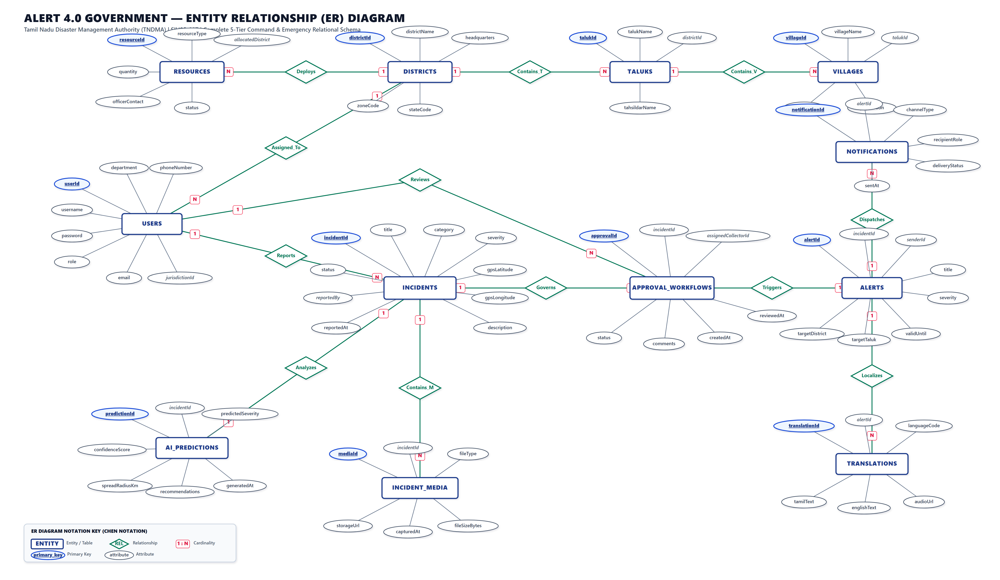

# 🚨 ALERT 4.0 GOVERNMENT (AlertGov AI)

<div align="center">


<br/>

**AI-Integrated Multi-Tier Disaster Management & Local Language Emergency Instruction System**  
*Built for the Tamil Nadu Disaster Management Authority (TNDMA) & Ministry of Home Affairs*

[Live Endpoints](#-microservice-port-directory) • [Architecture](#-system-architecture) • [Getting Started](#-getting-started) • [ER Diagram](#-database--er-diagram) • [API Specs](#-documentation--artifacts) • [Team](#-team--institution)

</div>

---

## 📌 Project Overview

**ALERT 4.0 GOVERNMENT** is an enterprise-grade, cloud-native emergency response and multilingual disaster communication platform developed for **Smart India Hackathon 2025** under Problem Statement **`SIH25_097`**.

The platform unifies 5 administrative tiers into a single real-time decision loop:
1. **Village EOCs (VEO)**: Real-time ground reporting with photo evidence, GPS geotagging, and emergency classification.
2. **Taluk Command Centers (Tahsildar)**: Ground truth verification queue, spam/duplicate filtering, and priority escalation.
3. **District EOCs (DEC)**: Geospatial GIS incident heatmapping, resource allocation, and broadcast draft composition.
4. **District Collectorates (Collector)**: Executive approval workflows, legal declarations (e.g., Section 144 / school holidays), and emergency escalation governance.
5. **State Command Center (SDMA)**: 38-district statewide readiness monitoring, inter-district asset mobilization, and state advisories.

---

## ⚡ Core Capabilities

- 🤖 **Local LLM Risk Engine (Ollama / Llama 3)**: Air-gapped AI inference for automated risk scoring, spam detection, and official bilingual (**English & Tamil தமிழ்**) instruction formulation.
- 🌦️ **Meteorological Integration & Circuit Breakers**: Live weather telemetry via Open-Meteo with **Resilience4j** fault-tolerance during network degradation.
- 🗺️ **Interactive GIS Spatial Mapping**: Leaflet-based geospatial maps showing active emergency heatmaps, safe shelters, and dynamic evacuation corridors.
- 🗄️ **Polyglot Dual-Database Architecture**:
  - **Oracle Database XE**: ACID-compliant transactional persistence for users, audit trails, approval states, and broadcasts.
  - **MongoDB**: High-throughput GridFS document store for photographic field evidence and localized audio instructions.
- 🔐 **Stateless JWT Security & RBAC**: Microservice authorization with role-scoped gateways (VEO, Taluk, District, Collector, State Admin).
- 📊 **Executive Analytics & Visualization**: Recharts dashboards detailing response time trends, severity distribution, and 7-day incident volume.

---

## 🏗️ System Architecture

```
                                  [ React 19 + Vite Frontend ]
                                  (Port 5173 | Bilingual UI)
                                               │
                                               ▼
                              [ Spring Cloud API Gateway (Port 8081) ]
                                               │
               ┌───────────────────────┬───────┴───────────────────────┬────────────────────────┐
               ▼                       ▼                               ▼                        ▼
     [ Auth Service : 8082 ]  [ User Service : 8083 ]       [ Incident Service : 8084 ]  [ Alert Service : 8085 ]
               │                       │                               │                        │
               ▼                       ▼                               ▼                        ▼
     [ Approval Service : 8086 ] [ Notification Service : 8087 ] [ Analytics Service : 8088 ] [ AI Service : 8089 ]
                                                                                                │
                                                                                                ▼
                                                                                   [ FastAPI + Ollama : 8000 ]
                                                                                   (Llama 3 Local Inference)
```

---

## 🌐 Microservice Port Directory

| Service Component | Port | Technology Stack | Primary Function |
| :--- | :--- | :--- | :--- |
| **Frontend UI** | `5173` | React 19, Vite, Leaflet, Tailwind/Vanilla CSS | Bilingual multi-tier government dashboard |
| **API Gateway** | `8081` | Spring Cloud Gateway, Netty | Central reverse proxy, routing & CORS |
| **Auth Service** | `8082` | Spring Boot 3, Spring Security, JWT | Authentication, user credential verification |
| **User Service** | `8083` | Spring Boot 3, Spring Data JPA, Oracle XE | Official directory & jurisdictional profiles |
| **Incident Service** | `8084` | Spring Boot 3, Oracle XE, MongoDB | Field incident ingestion & media attachments |
| **Alert Service** | `8085` | Spring Boot 3, Oracle XE | Public broadcast formulation & target routing |
| **Approval Service** | `8086` | Spring Boot 3, Oracle XE | Multi-tier collector review workflows |
| **Notification Service** | `8087` | Spring Boot 3, Oracle XE | Multi-channel dispatch (SMS, Push, Voice) |
| **Analytics Service** | `8088` | Spring Boot 3, Oracle XE | Trend aggregation & executive metrics |
| **AI Java Bridge** | `8089` | Spring Boot 3, Resilience4j | Circuit breaker bridge to Python AI engine |
| **AI Python Engine** | `8000` | FastAPI, Uvicorn, Requests | Prompt engineering & meteorological advisory |
| **Eureka Discovery** | `8761` | Spring Cloud Netflix Eureka | Dynamic microservice discovery registry |
| **Ollama Local LLM** | `11434`| Ollama, Llama 3 (8B) | Local LLM language model execution |

---

## 📊 Database & ER Diagram

The database architecture employs a classic **Chen Notation** schema bridging relational structures and document multimedia:

<div align="center">

[](AlertGov_ER_Diagram.pdf)
*Click image to view high-resolution vector PDF*

</div>

### Relational Entities (Oracle Database XE):
- `USERS` (<u>userId</u>, username, password, role, department, phoneNumber, email, jurisdictionId)
- `DISTRICTS` (<u>districtId</u>, districtName, headquarters, zoneCode, stateCode)
- `TALUKS` (<u>talukId</u>, talukName, districtId, tahsildarName)
- `VILLAGES` (<u>villageId</u>, villageName, talukId, riskZone, population)
- `INCIDENTS` (<u>incidentId</u>, title, category, severity, status, reportedBy, date, description)
- `APPROVAL_WORKFLOWS` (<u>approvalId</u>, incidentId, assignedCollectorId, status, comments, createdAt)
- `ALERTS` (<u>alertId</u>, incidentId, senderId, title, severity, targetDistrict, targetTaluk, validUntil)
- `TRANSLATIONS` (<u>translationId</u>, alertId, languageCode, tamilText, englishText, audioUrl)
- `NOTIFICATIONS` (<u>notificationId</u>, alertId, channelType, recipientRole, deliveryStatus, sentAt)
- `AI_PREDICTIONS` (<u>predictionId</u>, incidentId, predictedSeverity, spreadRadiusKm, recommendations)
- `RESOURCES` (<u>resourceId</u>, resourceType, allocatedDistrict, quantity, officerContact, status)

### Document Collections (MongoDB):
- `INCIDENT_MEDIA` (<u>mediaId</u>, incidentId, contentType, data [Binary/Base64], uploadedAt)

---

## 🚀 Getting Started

### Prerequisites
- **JDK 17+** (Java Development Kit)
- **Node.js 18+** & **npm**
- **Python 3.10+** (with `pip` & virtual environment)
- **Ollama** installed with `llama3` pulled (`ollama pull llama3`)
- **Git**

---

### Quick Launch (One-Command Startup)

Start all 11 backend microservices, the AI engine, Eureka registry, and the Vite frontend with a single command:

#### Using Node.js Runner:
```bash
node runner.cjs
```

#### Using PowerShell:
```powershell
powershell -ExecutionPolicy Bypass -File .\start-services.ps1
```

#### Check Health of All Services:
```powershell
powershell -ExecutionPolicy Bypass -File .\check-status.ps1
```

#### Stop All Running Services:
```powershell
powershell -ExecutionPolicy Bypass -File .\stop-services.ps1
```

---

## 🔑 Default Authorized Credentials

| Jurisdiction Level | Username | Password | Role | Access Scope |
| :--- | :--- | :--- | :--- | :--- |
| **State SDMA** | `STA-TN` | `admin` | `STATE` | Statewide 38-District Command, Resource Logistics |
| **District Collector** | `COL-CBE` | `admin` | `COLLECTOR` | Executive Incident Sign-off & Section 144 Orders |
| **District EOC** | `DEC-CBE` | `admin` | `DISTRICT` | District GIS Heatmap, Resource Allocation |
| **Taluk Tahsildar** | `TAL-SULUR` | `admin` | `TALUK` | Incident Verification Queue & Ground Validation |
| **Village Operator** | `VEO-SULUR-1` | `admin` | `VILLAGE` | Ground Incident Reporting with Photo Evidence |

*Full directory of 311 pre-provisioned district/taluk/village accounts is available in [`AlertGov_Login_Credentials.pdf`](AlertGov_Login_Credentials.pdf).*

---

## 📁 Repository Structure

```
ALERT 4.0 GOVERNMENT/
├── alertgov-ai/                  # Python FastAPI + Ollama Llama 3 Microservice
│   ├── main.py                   # AI risk inference & weather advisory endpoints
│   └── requirements.txt          # Python dependencies
├── alertgov-backend/             # Java 17 / Spring Boot Microservices
│   ├── api-gateway/              # Spring Cloud Gateway (Port 8081)
│   ├── discovery-server/         # Netflix Eureka Service Discovery (Port 8761)
│   ├── auth-service/             # JWT Authentication & RBAC (Port 8082)
│   ├── user-service/             # District/Taluk/Village Directory (Port 8083)
│   ├── incident-service/         # Field Reporting & Media Persistence (Port 8084)
│   ├── alert-service/            # Alert Broadcast Management (Port 8085)
│   ├── approval-service/         # Collector Multi-Tier Approval Workflow (Port 8086)
│   ├── notification-service/     # Public Channel Dispatchers (Port 8087)
│   ├── analytics-service/        # Aggregation & Trend Engine (Port 8088)
│   └── ai-service/               # Resilience4j Circuit Breaker Bridge (Port 8089)
├── alertgov-frontend/            # React 19 + Vite Frontend Application
│   ├── src/pages/                # 5-Tier Role-Based Dashboards & Workflows
│   ├── src/components/           # Reusable UI, GIS Maps, Audio Player, TopBar
│   └── src/context/              # AuthContext, LanguageContext (Bilingual i18n)
├── AlertGov_ER_Diagram.png       # 4K Ultra-Sharp Chen Notation ER Diagram
├── AlertGov_ER_Diagram.pdf       # Printable A3 Landscape Vector ER Diagram
├── ALERTGOV_Final_SRS_30Pages.pdf# Complete 30-Page IEEE Std 830-1998 Specification
├── Document_Revision_History.pdf # 26-Iteration Document Revision History Page
├── runner.cjs                    # Multi-process Node.js daemon launcher
├── start-services.ps1            # Native PowerShell background startup script
├── check-status.ps1              # Port health & HTTP status auditor
└── README.md                     # Project master documentation
```

---

## 📑 Documentation & Artifacts

- 📄 **IEEE Std 830-1998 Specification**: [`ALERTGOV_Final_SRS_30Pages.pdf`](ALERTGOV_Final_SRS_30Pages.pdf)
- 📊 **Entity-Relationship Diagram**: [`AlertGov_ER_Diagram.pdf`](AlertGov_ER_Diagram.pdf) | [`AlertGov_ER_Diagram.png`](AlertGov_ER_Diagram.png)
- 📝 **Exhaustive 71 REST Endpoints Catalog**: [`api_documentation.md`](api_documentation.md) | [`API_Documentation.pdf`](API_Documentation.pdf)
- 🗄️ **Oracle Database Schema Reference**: [`database_documentation.md`](database_documentation.md) | [`Database_Documentation.pdf`](Database_Documentation.pdf)
- 📜 **Document Revision History (v1.0 - v2.0)**: [`Document_Revision_History.pdf`](Document_Revision_History.pdf)

---

## 👥 Team & Institution

**Team**: Cognitive Crew  
**Institution**: Karpagam College of Engineering, Coimbatore, Tamil Nadu  
**Initiative**: Smart India Hackathon (SIH 2025) — Problem Statement `SIH25_097`

| Team Member | Role & Responsibilities |
| :--- | :--- |
| **Farah Hamna M** | System Architecture, Security RBAC & IEEE Documentation |
| **Rishikesh V** | Full-Stack Microservices, Spring Cloud Gateway & Dual DB Integration |
| **Shruthin K** | AI Prompt Engineering, Meteorological Feeds & GIS Visualizations |

---

<div align="center">

**Developed with ❤️ for the Tamil Nadu Disaster Management Authority (TNDMA)**

</div>
